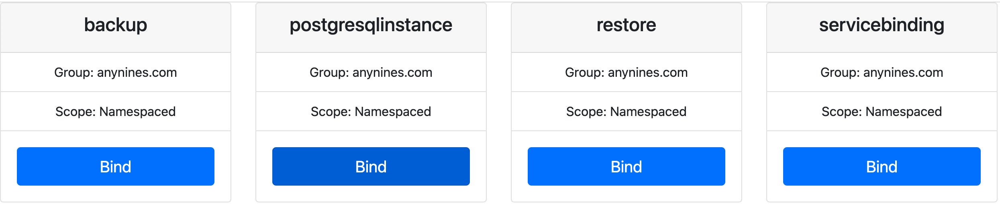

# Deploying Klutch on Rancher Desktop

This guide provides step-by-step instructions for setting up a Klutch control plane on a local [Rancher Desktop](https://rancherdesktop.io/)
instance.

The process involves a one-time manual configuration of the Rancher Desktop application, followed by an automated script
that deploys the entire Klutch stack.

### Prerequisites

Before running the deployment script, you must install and configure Rancher Desktop correctly.

1.  **Install Rancher Desktop**: Follow the official [installation instructions](https://docs.rancherdesktop.io/getting-started/installation/)
for your operating system. *Tested with version:* 1.19.3
2. **Ensure `dockerd` is running:** This installation uses the Rancher Desktop GUI option for `dockerd`. You can verify it in **Preferences > Container Runtime** by selecting **dockerd (moby)**.
3.  **Configure Rancher Desktop Application (GUI)**:
    *   Start the Rancher Desktop application.
    *   Go to **Preferences** > **Virtual Machine** > **Volumes** and select **virtiofs**. This is a more performant
    approach that helps deal with the I/O spikes that can occur during the Klutch installation.

        Note that `virtiofs` is not supported by the `QEMU` emulation engine. You must select an emulation option that
        is compatible with it in your environment from the **Emulation** tab. For example, on macOS, you need to select
        the **VZ** emulation option under the main **Virtual Machine** settings.
    *   Go to **Preferences** > **Kubernetes Settings**.
    *   **CRITICAL**: **Uncheck** the box for **Enable Traefik**. The Klutch installation uses its own NGINX Ingress
        Controller, and leaving Traefik enabled will cause port conflicts on `80` and `443`.
    *   Click **Apply** and wait for the Kubernetes cluster to be ready.

4.  **Configure Host Access (Command Line)**:
    *   **Enable Hostname for TLS**: The Klutch backend needs to communicate with the Kubernetes API server using a
        stable hostname. On macOS, run the following command in your terminal to add a TLS SAN (Subject Alternative Name) for
        `host.lima.internal` and `host.docker.internal` to the K3s server.

        ```bash
        echo -e "env:\n  K3S_EXEC: --tls-san host.lima.internal --tls-san host.docker.internal" > ~/Library/Application\ Support/rancher-desktop/lima/_config/override.yaml
        ```
        **Note**: After running this command, you must **Quit and Restart** Rancher Desktop for the change to take effect.

    *   **Configure Host DNS**: Add the following entry to your local `/etc/hosts` file. This is required for your
         machine to resolve the OIDC issuer URL.

        ```
        echo "127.0.0.1 host.lima.internal" | sudo tee -a /etc/hosts
        ```

5.  **Install k3d**: The setup script uses `k3d` to create a separate application cluster. If you don't have it, install it now:
    *   [k3d Installation Guide](https://k3d.io/v5.4.1/#installation)


## Automated installation using a setup script

> **NOTE:  The Rancher-Desktop overlay is for development and testing only**
>
> The provided script and the rancher-desktop Kustomize overlay are intended solely for local development and testing. This
setup is not secure, it uses plain HTTP for endpoints and includes hardcoded secrets and credentials. **Do not use this configuration in production environments.**


Once your Rancher Desktop environment is correctly configured, the rest of the installation is automated.

From the root of this repository, execute the following script:

```bash
./scripts/rancher-desktop/rancher-desktop.sh
```

**Troubleshooting Tip**: If the script fails with a `resource mapping not found... ensure CRDs are installed first` error,
this is a common race condition. The Crossplane controller is still installing necessary components in the background.
Simply run the script again.

### What the Script Does

The script automates all the necessary steps to get your environment ready:

1.  **Verifies Context**: Ensures your `kubectl` context is correctly set to `rancher-desktop`.
2.  **Exports CA Certificate**: The script automatically exports the cluster's root Certificate Authority (CA) and saves
    it to `overlays/rancher-desktop/klutch-control-plane-ca.crt`. The Klutch backend requires this certificate to
    securely communicate with the Kubernetes API server.
3.  **Installs All Components**: It uses Kustomize to build and apply all necessary components using the
     `overlays/rancher-desktop` overlay. This includes the NGINX Ingress Controller, Crossplane, Cert-Manager, the a8s
      Framework, Minio, and the Klutch backend with Dex.
4.  **Waits for Readiness**: The script includes checks to ensure all deployments and pods are fully running before
    proceeding.
5.  **Creates Application Cluster**: Finally, it uses `k3d` to create a separate cluster named `klutch-app`. This
     cluster will act as the consumer of your data services.

## Bind to Klutch’s APIs from the Application Cluster

After the script completes successfully, it will display a final command that you must run manually. This command binds
your new `klutch-app` cluster to the control plane running in Rancher Desktop.

Copy and paste the command into your terminal:

```bash
kubectl bind http://host.lima.internal/export \
  --konnector-image public.ecr.aws/w5n9a2g2/anynines/konnector:v1.3.0 \
  --context k3d-klutch-app
```

This command uses the `kubectl-bind` plugin to install a lightweight "konnector" pod into the `klutch-app` cluster,
which acts as a secure proxy to the control plane.

For this environment, use the following credentials:

* **Email Address:** `admin@example.com`
* **Password:** `password`

Once authenticated, you can select the service to bind using the Klutch web UI, as shown below:



You can now start provisioning data services, your App Cluster is fully configured and **ready to go!**

**Note:** If the login page displays a `400 Bad Request` or `Request Header Or Cookie Too Large` error, please **clear the cookies**
for the `host.lima.internal` site in your browser and try again.

## Cleanup

When you are finished, you can tear down the environment:

1.  **Delete the k3d application cluster**:
    ```bash
    k3d cluster delete klutch-app
    ```
2.  **Reset the Rancher Desktop cluster**:
    *   Open the Rancher Desktop GUI.
    *   Click the **Troubleshooting** tab.
    *   Click **Factory Reset**.
